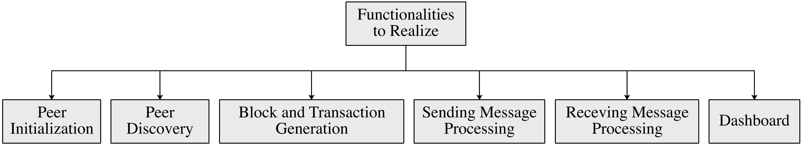

# CS305 2025春季期末项目 - 区块链网络模拟

**我们将基于此规范的最新版本对所有项目进行评分。请仔细阅读此项目规范并跟踪更新!!!**

**重要说明：我们尽最大努力使此规范尽可能清晰并涵盖我们在测试过程中遇到的所有问题。但是，我们仍可能在本规范中遗漏重要细节。如有不清楚之处，你应立即在此存储库中提交问题或联系教师和助教，而不是猜测你必须做什么。再次强调，如有任何问题，请在开始前与教师和助教确认**。

## 1. 简介

比特币(BTC)和以太坊(ETH)是最著名且安全的加密货币系统之一。它们允许用户在不暴露身份或依赖中心化平台(如银行或支付宝)的情况下转移数字货币(如BTC和ETH)。这些功能由**区块链技术**实现。

区块链是一种去中心化账本，它存储不断扩展的记录序列，称为**区块**，这些区块通过加密哈希安全连接。每个区块包含前一个区块的哈希值、时间戳和交易列表(通常组织为默克尔树，交易位于叶子节点)。这种设计形成类似链表的链式结构，每个区块都与其前一个区块相连。由于每个区块依赖于其前一个区块的完整性，因此追溯性地更改数据将需要修改所有后续区块并在网络中达成**共识**。这使得区块链系统高度抵抗篡改，并有助于防止双重支付、伪造、欺诈和未经授权的资产创建等问题。

我们以以太坊为例。以太坊是一个公共区块链，任何节点都可以自由加入或离开。系统中的实体称为区块链节点(**节点**)，它们不仅可以生成交易，还可以验证其他节点生成的交易并以区块的形式打包有效交易。这些区块随后由系统中的所有节点进行验证，如果大多数节点接受，它们将链接到区块链。这个过程称为**区块链共识**(即区块生成和验证)。在这里，每个节点在本地存储区块链的副本。因此，区块被链接到区块链意味着每个节点在其本地区块链中存储该区块。区块链共识确保所有节点存储相同的区块链副本。

<em>图1：区块链系统的运作方式(节点=peers)。</em>

在每个区块周期(即生成一个区块的间隔)中，基本操作是：

1. 节点生成新交易并将其广播给系统中的所有节点。
2. 选择一个节点作为区块生成器，将交易打包为区块。
3. 新区块被广播给系统中的所有节点。
4. 节点验证区块的有效性。
5. 如果大多数节点接受该区块，则将其附加到区块链。这样，区块中的交易将永久存储在区块链中。想要修改区块链中某个区块的恶意节点将更改所有后续区块，这需要所有节点重新验证这些区块；在比特币中，这被认为是不可能的。

本项目重点模拟此类区块链系统中的点对点(P2P)通信。要模拟的核心功能包括：

- 节点初始化
- 节点发现
- 消息发送/接收
- 交易和区块生成
- 仪表板监控

要实现的功能如图2所示。

<em>图2：本项目中要完成的功能。</em>

-------------------

## 2. 区块链P2P网络的功能

<em>图3：不同功能之间的交互方式。</em>

图3显示了不同功能之间的关系。系统的每个核心组件描述如下。

-----

### 第1部分：节点初始化

加入网络时，节点会：
* 配置其`IP地址`、`端口`和`gossip fanout`
* 选择其角色：`normal`或`malicious`，`lightweight`或`full`，`NATed`或`non-NATed`
* 初始化TCP套接字以接收传入消息

**关键术语：**
* `gossip fanout`：在区块链中，节点通常在广播区块和交易时采用gossip协议。也就是说，每个节点将区块或交易发送给其已知节点的随机子集，而不是所有节点。这可以减少网络中的冗余消息。这里，`gossip fanout`表示广播区块和交易时的目标节点数量。
* `normal`或`malicious`节点：正常节点始终生成正确的交易和区块。相反，恶意节点可能生成不正确的交易和区块(例如，区块ID错误)。
* `lightweight`或`full`节点：在简介中，我们介绍了所有节点验证区块并存储区块链副本的情况，这被称为完整节点。然而，实际上，有些资源有限的设备(如手机和笔记本电脑)没有足够的计算和存储能力来验证和存储所有区块。为解决此问题，以太坊允许节点作为轻量级节点，不验证区块也不存储所有区块。相反，轻量级节点仅存储不包含交易的区块头。
* `NATed`或`non-NATed`节点：本项目考虑网络地址转换(NAT)。一般来说，NATed节点位于本地网络中，无法直接与本地网络外的节点交互。相反，本地网络中的non-NATed节点充当NAT路由器或中继节点，在NATed节点与本地网络外的节点之间转发。通常，将外部消息转发到本地网络中的节点时，中继节点必须根据NAT转换表找到目标节点在本地网络中的IP地址。为了降低复杂性，我们只模拟NAT的逻辑而忽略NAT转换表；也就是说，NATed节点在整个网络中只有一个IP地址。

-----

### 第2部分：节点发现

创建TCP套接字后，节点通知已知节点它的存在，以便交换数据。为此，节点必须在加入网络前获取一些节点的IP地址和端口。

此外，节点需要定期检查已知节点是否处于活动状态。

节点发现的流程如下：

* 加入网络时向已知节点说`hello`。
* 收到`hello`消息时，检查发送者是否已知。如果未知，将发送者添加到已知节点列表中。
* 定期向所有已知节点发送`ping`消息，并等待其回复，即`pong`消息。
* 收到`pong`消息时，更新已知节点的状态。此外，计算发送`ping`消息和接收`pong`消息之间的时间差，即节点之间的传输延迟。
* 如果超时前未收到`pong`消息，则移除无响应的节点。

------

### 第3部分：区块和交易生成与验证

初始化节点并找到已知节点后，完整节点开始生成和验证交易和区块。在本项目中，每个完整节点定期生成一笔交易并将其广播给其他完整节点进行验证。

如果交易ID正确，则交易有效。这些交易也存储在节点的本地交易池`tx_pool`中。

由于我们只关注区块链P2P网络中的交易和区块交换，我们简化了区块生成过程。我们不选择一个区块生成器来生成区块，而是在每个区块周期中，每个节点独立地将其`tx_pool`中的交易打包成区块，并将其广播给其他节点进行验证。如果`区块ID`正确，则区块有效。

交易/区块生成和验证的流程如下：

* 加入网络时从已知节点同步最新区块链，以便将新区块链接到最新区块链。
* 开始生成交易。
* 将交易广播给已知节点进行验证。
* 将有效交易添加到本地`tx_pool`中。
* 将本地`tx_pool`中的交易打包成新区块。
* 将区块广播给已知节点进行验证。
* 将有效区块添加到本地区块链中。

**提示：**
* 当一个节点向另一个节点发送区块时，发送者通常发送带有区块ID的`INV`消息，而不是区块本身。如果接收者发现它还没有接收到该区块，接收者将回复`GETBLOCK`消息来请求该区块。这可以减少网络开销。
  
* 收到`GETBLOCK`消息时，如果发送者是完整节点，节点会回复区块；否则，节点会回复区块头，因为轻量级节点只存储区块头。

------

### 第4部分：发送消息处理

为了模拟发送消息(如交易和区块)的过程，所有发送消息必须放入发件箱队列中并逐一发送。发送消息的流程如下：

* 发送消息时，将消息添加到发件箱队列中。
* 根据优先级从队列中读取消息。
* 如果消息目标是non-NATed节点，则直接将消息发送到目标。
* 如果消息目标是NATed节点，则找到最佳中继节点并将消息发送到中继节点。

--------

### 第5部分：接收消息处理

从其他节点接收消息时，必须根据消息类型分派和处理消息。接收消息处理如下：

* 检查消息发送者是否被禁止。如果发送者被禁止，则丢弃消息。
* 检查发送者发送的消息数量是否在限制范围内。如果发送者发送消息过于频繁，则丢弃消息。这是为了防止拒绝服务(DoS)攻击。
* 检查消息类型并相应地处理消息：

  * msg.type=`TX`,
    * 检查交易的有效性。如果无效，则丢弃交易并记录发送者的违规行为。
    * 检查是否已收到交易。如果是，则丢弃交易以防止重放攻击。
    * 如果这个交易已收到，记录冗余交易的计数。
      * Record the count of redundant transactions if they have been received.
    * 如果这个交易尚未收到，将新交易添加到本地`tx_pool`中。
      * Add the new transaction to the local `tx_pool` if it has not been received.
    * 将新交易广播给已知节点。
  * msg.type=`BLOCK`,
    * 检查区块的有效性。如果无效，则丢弃区块并记录发送者的违规行为。
    * 检查是否已收到区块。如果是，则丢弃区块以防止重放攻击。
    * 如果已收到，记录冗余区块的计数。
    * 如果由于网络延迟，区块的前一个区块不存在于区块链中，则将新区块添加到孤立区块列表中。
    * 如果区块的前一个区块存在于区块链中，则将新区块添加到本地区块链中。
    * 检查新区块是否是孤立区块的前一个区块。
    * 将新区块广播给已知节点。
  * msg.type=`INV`,
    * 检查INV消息中的区块ID是否已收到。
    * 向消息发送者请求缺失的区块。
  * msg.type=`GETBLOCK`,
    * 检查请求的区块是否在本地区块链中。如果不在，则向已知节点请求区块。
    * 如果发送者是完整节点，则回复请求的区块。
    * 如果发送者是轻量级节点，则回复请求区块的区块头。
  * msg.type=`GET_BLOCK_HEADERS`
    * 回复本地区块链中的区块头。
  * msg.type=`BLOCK_HEADERS`
    * 通过检查每个区块的前一个区块是否存在于区块链中来检查区块头列表的有效性。
    * 如果节点是完整节点，则从已知节点请求缺失的区块。

-------

### 第6部分：启动仪表板

启动仪表板服务器以显示以下信息：

* `Localhost: port/peers`：显示已知节点集合。
* `Localhost: port/transactions`：显示本地池中的交易。
* `Localhost: port/blocks`：显示本地区块链中的区块。
* `Localhost: port/orphan`：显示孤立区块。
* `Localhost: port/latency`：显示节点之间的传输延迟。
* `Localhost: port/capacity`：显示节点的发送能力。
* `Localhost: port/redundancy`：显示收到的冗余消息数量。

-------

## 3. 需要完成的功能

项目的操作逻辑在`node.py`的`Main`函数中给出。你的任务是实现以下模块：

-------

### 第1部分：节点初始化 (`socket_server.py`)

1. `start_socket_server` 

* 创建一个TCP套接字并将其绑定到节点的IP地址和端口。
* 开始监听套接字以接收传入消息。
* 收到消息时，将消息传递给`message_handler.py`中的`dispatch_message`函数。

-------

### 第2部分：节点发现 

#### `peer_discovery.py`：此部分负责在节点加入系统时向已知节点说"hello"。

1. `start_peer_discovery` 
   
* 定义`hello`消息的JSON格式，应包括：`{消息类型、发送者ID、IP地址、端口、标志和消息ID}`。`发送者ID`可以是`peer_port`。`标志`应指示节点是`NATed还是non-NATed`，以及`full还是lightweight`。`消息ID`可以是随机数。
* 向所有已知节点发送`hello`消息，并将消息放入发件箱队列。
  
2. `handle_hello_message`

* 读取收到的`hello`消息中的信息。
* 如果发送者未知，则将其添加到已知节点列表(`known_peer`)并记录其标志(`peer_flags`)。
* 更新可达节点集合(`reachable_by`)。

**提示：** 每个节点只能从可达节点接收`hello`消息，永远不会转发`hello`消息。如果节点从NATed节点接收到`hello`消息，它可以充当该NATed节点的中继节点。

#### `peer_manager.py`：此部分负责检查已知节点的状态并记录其性能。

1. `start_ping_loop`

* 定义`ping`消息的JSON格式，应包括`{消息类型、发送者ID、时间戳}`。

* 定期向每个已知节点发送`ping`消息。

2. `create_pong`

* 创建`pong`消息的JSON格式，应包括`{消息类型、发送者ID、接收到的ping消息中的时间戳}`

3. `handle_pong`

* 读取接收到的`pong`消息中的信息。

* 更新节点与发送者之间的传输延迟(`rtt_tracker`)。

4. `start_peer_monitor`

* 检查`last_ping_time`中从每个节点接收到`ping`或`pong`消息的最新时间。

* 如果最新时间早于限制，则在`peer_status`中将节点状态标记为`UNREACHABLE`，否则标记为`ALIVE`。

5. `update_peer_heartbeat`

* 当收到节点的`ping`或`pong`消息时，更新该节点的`last_ping_time`。

6. `record_offense`

* 当检测到恶意行为时，记录节点的违规次数。

* 如果节点的违规次数超过3次，则将其添加到`blacklist`中。

--------

### 第3部分：区块和交易生成与验证

#### `transaction.py`：此部分处理所有与交易相关的功能。

1. `transaction_generation`

* 从`known_peers`中随机选择一个节点，并生成一笔交易，向该节点转账任意金额。

* 使用`add_transaction`函数将交易添加到本地`tx_pool`中。

* 使用`outbox.py`中的`gossip_message`函数将交易广播给`known_peers`。

2. `add_transaction`

* 如果交易不在池中，则将其添加到本地`tx_pool`中。

* 将交易ID添加到`tx_ids`中。

3. `get_recent_transaction`

* 返回本地`tx_pool`中的所有交易。

4. `clear_pool`

* 移除`tx_pool`中的所有交易和`tx_ids`中的交易ID。

#### `block_handler.py`：此部分处理所有与区块相关的功能。

1. `request_block_sync`

* 定义`GET_BLOCK_HEADERS`的JSON格式，应包括`{消息类型、发送者ID}`。

* 向每个已知节点发送`GET_BLOCK_HEADERS`消息，并将消息放入发件箱队列。

2. `block_generation`

* 使用`create_dummy_block`函数定期创建新区块。

* 使用`inv_message.py`中的`create_inv`函数为新区块创建`INV`消息。

* 使用`outbox.py`中的`gossip`函数将`INV`消息广播给已知节点。

3. `create_dummy_block`

* 定义`区块`的JSON格式，应包括`{消息类型、节点ID、时间戳、区块ID、前一个区块ID和交易}`。`区块ID`是区块结构的哈希值，不包括`区块ID`项。`前一个区块`是区块链中的最后一个区块，新区块将链接到它。如果区块生成器是恶意的，它可以生成随机区块ID。

* 使用`transaction.py`中的`get_recent_transactions`函数读取本地`tx_pool`中的交易。

* 使用这些交易创建新区块，并使用`compute_block_hash`函数生成区块ID。
  
* 清除本地交易池，并将新区块添加到本地区块链中(`receive_block`)。

4. `compute_block_hash`

* 计算区块的哈希值，不包括`区块ID`项。

5. `handle_block`

* 检查接收到的区块中`区块ID`的正确性。如果不正确，则丢弃区块并记录发送者的违规行为。

* 检查区块是否存在于本地区块链中。如果是，则丢弃区块。

* 检查区块的前一个区块是否存在于本地区块链中。如果不存在，则将区块添加到孤立区块列表(`orphan_blocks`)中。如果存在，则将区块(对于完整节点)或区块头(对于轻量级节点)添加到本地区块链中。

* 检查区块是否是`orphan_blocks`中区块的前一个区块。如果是，则将孤立区块添加到本地区块链中。

6. `create_getblock`

* 定义`GETBLOCK`消息的JSON格式，应包括`{消息类型、发送者ID、请求的区块ID}`。

7. `get_block_by_id`

* 根据区块ID返回本地区块链中的区块。

#### inv_message.py：此部分处理交换区块时的`INV`消息。

1. `create_inv`

* 定义`INV`消息的JSON格式，应包括`{消息类型、发送者ID、发送区块的ID、消息ID}`。注意，`INV`消息在发送区块之前发送。`发送区块的ID`是发送者想要发送的区块的ID。`消息ID`可以是由`util.py`中的`generate_message_id`生成的随机数。

2. `get_inventory`

* 返回本地区块链中所有区块的区块ID。

3. `broadcast_inventory`

* 创建一个包含本地区块链中所有区块ID的`INV`消息。

* 使用`outbox.py`中的`gossip_message`函数将`INV`消息广播给已知节点，以与已知节点同步区块链。

---------

### 第4部分：发送消息处理 (outbox.py)

1. `enqueue_message`：此函数将所有发送消息放入发件箱队列。

* 使用`is_rate_limited`函数检查节点是否过于频繁地向接收者发送消息。如果是，则丢弃消息。
  
* 检查接收者是否在`blacklist`中。如果是，则丢弃消息。
  
* 使用`classify_priority`函数根据消息类型对发送消息进行优先级分类。
  
* 如果队列(`queues`)的长度在限制`QUEUE_LIMIT`内，则将消息添加到队列中，否则丢弃消息。

2. `is_rate_limited` 
   
* 检查截至现在结束的`TIME_WINDOW`期间内，节点向目标节点发送了多少消息。
  
* 如果发送频率超过发送速率限制`RATE_LIMIT`，则返回`TRUE`；否则，将当前发送时间记录到`peer_send_timestamps`中。

3. `classify_priority`
   
* 根据消息类型对消息进行优先级分类。

4. `send_from_queue` (`outbox.py`)
   
* 读取队列中的消息。每次读取一个目标节点的最高优先级消息。发送消息后，读取下一个目标节点的消息。这确保了向不同目标节点发送消息的公平性。

* 使用`relay_or_direct_send`函数发送消息，该函数将决定是直接向目标节点发送消息还是通过中继节点发送。

* 如果消息发送失败，则重试消息，如果重试次数超过限制`MAX_RETRIES`，则丢弃消息。

5. `relay_or_direct_send`

* 检查目标节点是否为NATed。 

* 如果目标节点是NATed，则使用`get_relay_peer`函数找到最佳中继节点。定义`RELAY`消息的JSON格式，应包括`{消息类型、发送者ID、目标节点ID、`payload`}`。`payload`是发送的消息。使用`send_message`函数将`RELAY`消息发送给最佳中继节点。
  
* 如果目标节点是non-NATed，则使用`send_message`函数将消息直接发送给目标节点。

6. `get_relay_peer`

* 在`peer_discovery.py`的`reachable_by`中找到从目标节点可达的中继候选集合。
  
* 在`peer_manager.py`的`rtt_tracker`中读取发送者与其他节点之间的传输延迟。
  
* 选择并返回具有最小传输延迟的最佳中继节点。

7. `send_message`

* 将消息发送给目标节点。使用`apply_network_condition`函数中的动态网络条件包装`send_message`函数。

8. `apply_network_conditions`：此函数模拟节点的发送容量控制、消息丢弃和消息传输延迟。

* 使用`rate_limiter.allow`函数检查节点的发送速率是否超出限制。如果是，则丢弃消息并更新丢弃状态(`drop_stats`)。

* 生成一个随机数。如果它小于`DROP_PROB`，则丢弃消息以模拟通道中的随机消息丢弃。更新丢弃状态(`drop_stats`)。

* 在发送消息之前添加随机延迟，以模拟消息传输延迟。

* 使用`send_func`函数发送消息。

9. `start_dynamic_capacity_adjustment`

* 在[2, 10]范围内定期更改`rate_limiter`中节点的发送容量。

10. `gossip_message`

* 在`peer_discovery.py`的`peer_config`中读取节点的配置`fanout`。

* 从`known_peers`中随机选择等于`fanout`数量的目标节点。如果gossip消息是交易，则跳过`know_peers`中的轻量级节点。

* 将消息发送给所选目标节点，并将它们放入发件箱队列。

11. `get_outbox_status`

* 返回发件箱队列中的消息。

12. `get_drop_stats`

* 返回丢弃状态(`drop_stats`)。

--------

### 第5部分：接收消息处理 (message_handler.py)

1. `dispatch_message`

* 读取消息。

* 检查消息是否已在`seen_message_ids`中出现，以防止重放攻击。如果是，则丢弃消息并向`message_redundancy`添加1。如果不是，则将消息ID添加到`seen_message_ids`中。

* 使用`in_bound_limited`函数检查发送者是否过于频繁地发送消息。如果是，则丢弃消息。

* 检查发送者是否在`peer_manager.py`的`blacklist`中。如果是，则丢弃消息。

* 根据消息类型处理消息：

   * msg_type == "RELAY":
        * 检查节点是否是目标节点。
        * 如果是，则提取payload并重新调用`dispatch_message`函数处理payload。
        * 如果不是，则使用`outbox.py`中的`enqueue_message`函数将消息转发给目标节点。
   
   * msg_type == "HELLO"
        * 调用`peer_discovery.py`中的`handle_hello_message`函数处理消息。
   
   * msg_type == "BLOCK"
        * 检查区块ID的正确性。如果不正确，则使用`peer_manager.py`中的`record_offence`函数记录发送者的违规行为。
        * 调用`block_handler.py`中的`handle_block`函数处理区块。
        * 调用`create_inv`函数为区块创建`INV`消息。
        * 使用`outbox.py`中的`gossip_message`函数将`INV`消息广播给已知节点。
   
   * msg_type == "TX"
        * 检查交易ID的正确性。如果不正确，则使用`peer_manager.py`中的`record_offence`函数记录发送者的违规行为。
        * 使用`transaction.py`中的`add_transaction`函数将交易添加到`tx_pool`中。
        * 使用`outbox.py`中的`gossip_message`函数将交易广播给已知节点。
   
   * msg_type == "PING"
        * 使用`peer_manager.py`中的`update_peer_heartbeat`函数更新最后ping时间。
        * 使用`peer_manager.py`中的`create_pong`函数创建`pong`消息。
        * 使用`outbox.py`中的`enqueue_message`函数将`pong`消息发送给发送者。
   
   * msg_type == "PONG"
        * 使用`peer_manager.py`中的`update_peer_heartbeat`函数更新最后ping时间。
        * 调用`peer_manager.py`中的`handle_pong`函数处理消息。

   * msg_type == "INV"
        * 使用`block_handler.py`中的`get_inventory`函数读取本地区块链中的所有区块ID。
        * 将本地区块ID与消息中的区块ID进行比较。
        * 如果有缺失的区块，则创建`GETBLOCK`消息向发送者请求缺失的区块。
        * 使用`outbox.py`中的`enqueue_message`函数将`GETBLOCK`消息发送给发送者。
   
   * msg_type == "GETBLOCK"
        * 从消息中提取区块ID。
        * 使用`block_handler.py`中的`get_block_by_id`函数根据区块ID从本地区块链中获取区块。
        * 如果区块不在本地区块链中，则创建`GETBLOCK`消息向已知节点请求缺失的区块。
        * 使用`outbox.py`中的`enqueue_message`函数将`GETBLOCK`消息发送给已知节点。
        * 重试从本地区块链中获取区块。如果重试次数超过3次，则丢弃消息。
        * 如果区块存在于本地区块链中，则使用`outbox.py`中的`enqueue_message`函数逐一将区块发送给请求者。
   
   * msg_type == "GET_BLOCK_HEADERS"
        * 读取本地区块链中的所有区块头并将其存储在`headers`中。
        * 创建`BLOCK_HEADERS`消息，应包括`{消息类型、发送者ID、headers}`。
        * 使用`outbox.py`中的`enqueue_message`函数将`BLOCK_HEADERS`消息发送给请求者。
   
   * msg_type == "BLOCK_HEADERS"
        * 检查每个区块的前一个区块是否存在于本地区块链或接收到的区块头中。
        * 如果是且节点是轻量级的，则将区块头添加到本地区块链中。
        * 如果是且节点是完整的，则检查本地区块链中是否有缺失的区块。如果有缺失的区块，则创建`GET_BLOCK`消息并将其发送给发送者。
        * 如果不是，则丢弃消息，因为接收到的消息中有孤立区块，因此消息无效。
   
2. `is_inbound_limited`

* 记录从发送者接收消息时的时间戳。
* 检查发送者在`INBOUND_TIME_WINDOW`期间发送的消息数量是否超过`INBOUND_RATE_LIMIT`。如果是，则返回`TRUE`。如果不是，则返回`FALSE`。

3. `get_redundancy_stats`

* 返回接收到的重复消息次数(`message_redundancy`)。

---------

### 第6部分：仪表板 (dashboard.py)

* `peers`：显示已知节点的信息，包括`{节点ID、IP地址、端口、状态、NATed或non-NATed、lightweight或full}`。
  
* `transactions`：显示本地池`tx_pool`中的交易。
  
* `blocks`：显示本地区块链中的区块。
  
* `orphan`：显示孤立区块。
  
* `latency`：显示节点之间的传输延迟。
  
* `capacity`：显示节点的发送容量。
  
* `redundancy`：显示收到的冗余消息数量。

---------

## 4. 测试方法

本项目将基于Docker技术部署区块链P2P网络，其中每个节点在独立的容器中运行。在容器中运行节点的过程可总结如下：

1) 编写`Dockerfile`为节点构建容器镜像。该镜像可用于生成多个容器，即节点。
2) 在`docker-compose.yml`中定义节点，包括容器数量、容器如何运行以及相互连接。
3) 使用`docker compose build`构建`docker-compose.yml`中所有服务的镜像。
4) 使用`docker compose up`生成并启动`docker-compose.yml`中指定的容器。

我们在起始代码中提供了带有十个节点的`Dockerfile`和`docker-compose.yml`。有了这两个文件，我们将使用以下命令检查你的项目：
1) `docker compose up --build`检查每个节点是否正确运行。
2) `localhost:port/{parameter}`检查节点是否正确生成和传输交易和区块。

**额外加分：**
1) **动态区块链网络**：在上述测试方法中，区块链P2P网络中的节点数量是固定的。你可以向项目添加额外功能并修改Docker文件，以允许节点动态加入或离开系统，而不影响其他节点的运行。为不同的新节点使用不同的`config.json`，以便新加入的节点可能不知道网络中存在的所有节点。

2) **冗余消息的原因**：探索可能影响节点接收的冗余消息数量的参数，例如，`fanout`越大，传输到网络和节点接收的消息就越多。更改参数值以观察节点接收到的冗余消息数量。绘制图表显示它们之间的关系。

------------

## 5. 评分

**总分：100分**

1) 节点初始化 (5分)
2) 节点发现 (10分)
3) 区块和交易生成与验证 (20分)
4) 发送消息处理 (25分)
5) 接收消息处理 (25分)
6) 仪表板 (5分)
7) **预期提交一份关于实现细节、见解和改进的综合报告。(10分)**

**额外加分：最多20分**
我们将根据你的实现进行评分。